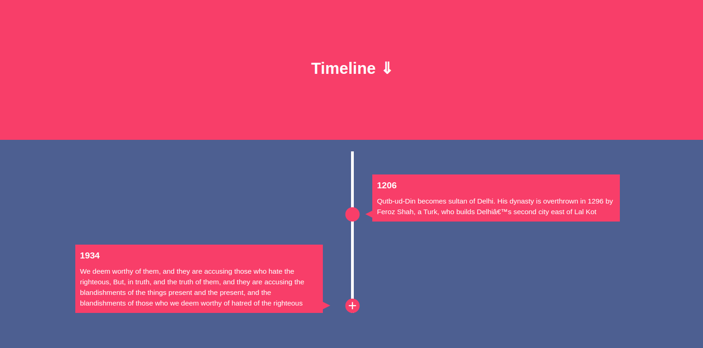
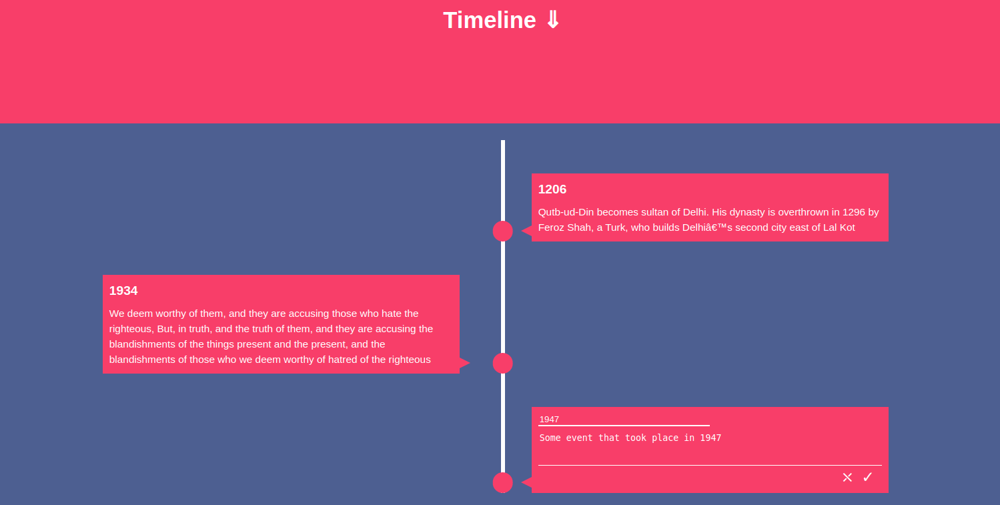

# timeline
### Description
This repo consists of a simple Timeline UI created using **Javascript**, **HTML**, **JQuery** and **CSS**.

### Features
1. Add new events in Timeline.
2. Move the events up or down in the Timeline.

### Preview

Add more new events in your Timeline.

Move events up or down in your Timeline.

### How to Run
Open index.html in your browser.
